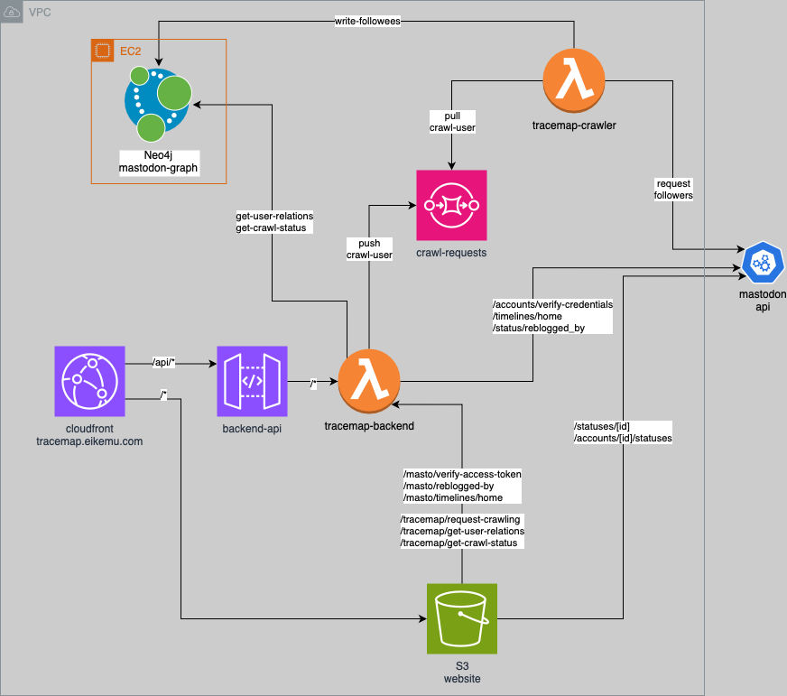

# TraceMap -   explore content propagation on mastodon

> [!WARNING]
> This application is under development and can only be tested locally.

TraceMap is a tool for for investigating information flow on mastodon.

## Local Setup

### Prerequisites

1. [download neo4j desktop](https://neo4j.com/download/)
2. create a new database
3. set the credentials: `user: neo4j` and `password: password123`

### Start TraceMap Locally

1. run `npm i` to install dependencies
2. run `npm start` to start the application on <http://localhost:3000/>

`client_id` and `client_secret` generated during authentication with your mastodon account are locally stored in an [.env file](/tracemap-api/.env).
This makes it possible to stay logged in after restarting the koa server.

## Technical Overview

### Infrastructure

The infrastructure of TraceMap is hosted on AWS.

